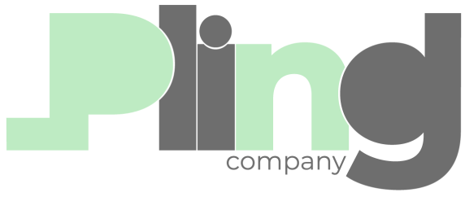

<div align="center">
  
  
  # Pling Company - Landing Page
  
  ### 🚀 Potencialize seu crescimento com campanhas de tráfego pago que convertem
  
  
  
  
  
  
  
  [](https://opensource.org/licenses/MIT)
  [](https://nodejs.org/)
  [](http://makeapullrequest.com)

</div>

## 📋 Sobre o Projeto

Este é o website oficial da **Pling Company**, uma agência especializada em **tráfego pago** que conecta empresas ao público certo no momento exato. O projeto foi desenvolvido como um freelancer para criar uma landing page moderna, responsiva e com animações elegantes que destacam os serviços da empresa.

### 🎯 Objetivo da Pling Company

A Pling Company cria e gerencia campanhas de tráfego pago focadas em resultados, com a missão de:

- Conectar empresas ao público-alvo ideal
- Transformar cliques em clientes reais
- Impulsionar vendas através de estratégias de marketing digital
- Otimizar ROI em campanhas pagas

## ✨ Características

- 📱 **Design Responsivo** - Otimizado para todos os dispositivos
- 🎭 **Animações Elegantes** - Implementadas com Framer Motion
- 🎨 **UI Moderna** - Interface limpa e profissional
- ⚡ **Performance Otimizada** - Construído com Vite
- 🌐 **SEO Friendly** - Estrutura semântica otimizada
- 🎪 **Efeitos Visuais** - Glassmorphism e micro-interações

## 🛠️ Tecnologias Utilizadas

### Frontend

- **React 18** - Biblioteca JavaScript para interfaces
- **TypeScript** - Tipagem estática para maior robustez
- **Tailwind CSS** - Framework CSS utilitário para estilização rápida
- **Framer Motion** - Biblioteca de animações para React
- **Lucide React** - Ícones SVG otimizados

### Ferramentas de Desenvolvimento

- **Vite** - Build tool rápido e moderno
- **ESLint** - Linting e formatação de código
- **PostCSS** - Processamento de CSS
- **PNPM** - Gerenciador de pacotes eficiente

## 🚀 Começando

### Pré-requisitos

- Node.js >= 18.0.0
- PNPM (recomendado) ou NPM

### Instalação

1. **Clone o repositório**

   ```bash
   git clone https://github.com/LucasBened/plig-company.git
   cd plig-company
   ```

2. **Instale as dependências**

   ```bash
   pnpm install
   # ou
   npm install
   ```

3. **Execute em modo de desenvolvimento**

   ```bash
   pnpm dev
   # ou
   npm run dev
   ```

4. **Abra no navegador**
   ```
   http://localhost:5173
   ```

## 📦 Scripts Disponíveis

```bash
# Desenvolvimento
pnpm dev          # Inicia o servidor de desenvolvimento
pnpm build        # Cria build de produção
pnpm preview      # Visualiza o build de produção
pnpm lint         # Executa o linting do código
```

## 🎨 Estrutura do Projeto

```
src/
├── assets/           # Imagens, SVGs e outros recursos
│   ├── images/       # Imagens do projeto
│   ├── logo_full.svg # Logo da empresa
│   └── animated.svg  # Ilustração principal
├── components/       # Componentes React
│   ├── ui/          # Componentes de UI reutilizáveis
│   ├── Header.tsx   # Cabeçalho responsivo
│   ├── Bean.tsx     # Componente de badge
│   └── [Social].tsx # Ícones das redes sociais
├── lib/             # Utilitários e configurações
│   └── utils.ts     # Funções utilitárias
├── App.tsx          # Componente principal
└── main.tsx         # Ponto de entrada da aplicação
```

## 🎭 Animações Implementadas

### Framer Motion Features

- **Stagger Animations** - Elementos aparecem sequencialmente
- **Fade In Up** - Texto surge de baixo para cima
- **Image Reveal** - Imagem principal com entrada suave
- **Social Icons Animation** - Ícones aparecem de baixo para cima
- **Bell Shake** - Sino tremula após todas as animações
- **Hover Effects** - Interações nos botões

### Responsividade

- **Mobile First** - Design otimizado para dispositivos móveis
- **Breakpoints Tailwind** - sm, md, lg, xl, 2xl
- **Typography Scaling** - Textos se ajustam proporcionalmente
- **Icon Sizing** - Ícones respondem ao tamanho da tela

## 📱 Compatibilidade

- ✅ Chrome (Latest)
- ✅ Firefox (Latest)
- ✅ Safari (Latest)
- ✅ Edge (Latest)
- ✅ Dispositivos móveis (iOS/Android)

## 📄 Licença

Este projeto está sob a licença MIT. Veja o arquivo [LICENSE](LICENSE) para mais detalhes.

## 👨‍💻 Desenvolvedor

**Lucas Benedito**

- GitHub: [@LucasBened](https://github.com/LucasBened)
- LinkedIn: [Lucas Benedito](https://www.linkedin.com/in/lucas-benedito)

## 🏢 Cliente

**Pling Company**

- Especializada em tráfego pago e marketing digital
- Foco em resultados e ROI otimizado
- Conectando empresas ao público certo

---

<div align="center">
  <p>Desenvolvido com ❤️ para a Pling Company</p>
  <p>© 2025 Pling Company. Todos os direitos reservados.</p>
</div>
